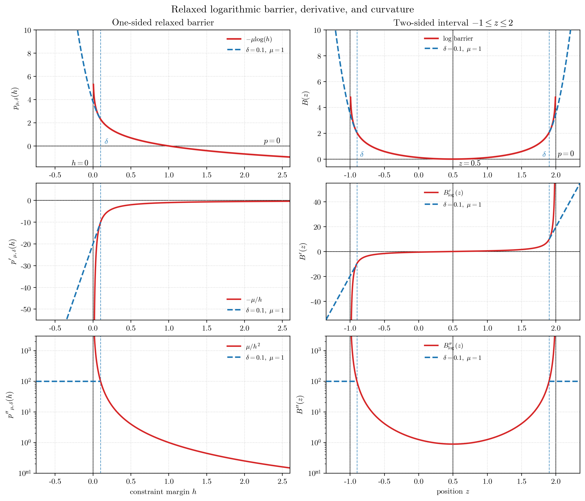
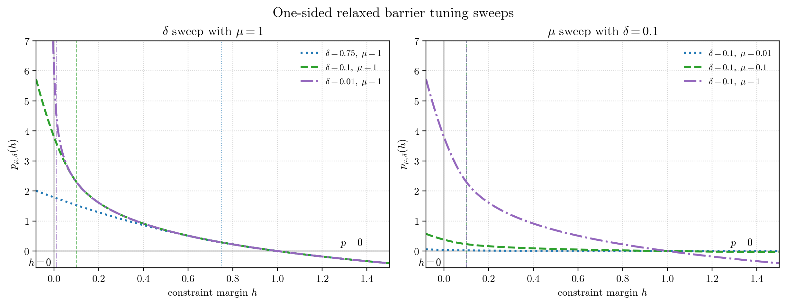

# Relaxed Barrier Functions: Soft Constraint and Penalty Function

This note describes the relaxed barrier functions (RBFs) penalty with **self-collision** constraint handling as an example.

In this repo, RBF means a **relaxed logarithmic barrier penalty** applied as a soft state inequality constraint.

## Constraint Margin

For each configured collision pair, OCS2 computes the signed clearance margin

$$
h_i(q) = d_i(q) - d_{\min},
$$

where:

- $d_i(q)$ is the current distance for collision pair $i$.
- $d_{\min}$ is `selfCollision.minimumDistance`.
- The constraint is satisfied when $h_i(q) \ge 0$.

The RBF self-collision cost is

$$
J_{\mathrm{selfCollision}}(q)
=
\sum_i p_{\mu,\delta}\left(h_i(q)\right).
$$

So every configured pair contributes a penalty. The runtime hard stop is separate: it checks the minimum distance over all pairs and falls back to hold mode if that minimum is below `selfCollision.hardStopDistance`.

## Penalty Function

OCS2 implements the relaxed barrier for a scalar inequality $h \ge 0$ as

$$
p_{\mu,\delta}(h)
=
\begin{cases}
-\mu \log(h),
& h > \delta,
\\[6pt]
\mu
\left[
-\log(\delta)
+ \frac{1}{2}
\left(
\left(\frac{h - 2\delta}{\delta}\right)^2 - 1
\right)
\right],
& h \le \delta.
\end{cases}
$$

The quadratic extension makes the penalty finite and smooth when the constraint is violated. It matches the logarithmic branch in value, first derivative, and second derivative at $h=\delta$.

The derivatives used by the solver are

$$
p'_{\mu,\delta}(h)
=
\begin{cases}
-\dfrac{\mu}{h},
& h > \delta,
\\[8pt]
\mu \dfrac{h - 2\delta}{\delta^2},
& h \le \delta,
\end{cases}
$$

and

$$
p''_{\mu,\delta}(h)
=
\begin{cases}
\dfrac{\mu}{h^2},
& h > \delta,
\\[8pt]
\dfrac{\mu}{\delta^2},
& h \le \delta.
\end{cases}
$$

At the boundary $h=0$:

$$
p'_{\mu,\delta}(0) = -\frac{2\mu}{\delta},
\qquad
p''_{\mu,\delta}(0) = \frac{\mu}{\delta^2}.
$$

This is the main tuning fact: decreasing $\delta$ makes the penalty much stiffer near and inside the boundary.

## Figure

The figures in this section are generated by
`docs/assets/plot_rbf.py`.



The first figure compares the unrelaxed logarithmic barrier against one relaxed barrier with $\delta=0.5$ and $\mu=1$. The top row shows the penalty value, the middle row shows the first derivative, and the bottom row shows the curvature.
The dashed blue vertical guide lines mark the quadratic-extension switch points.

The left column shows the one-sided relaxed barrier. The right column shows a two-sided interval example built from two one-sided barriers:

$$
B(z)
=
\beta(z - z_{\min}; \delta)
+
\beta(z_{\max} - z; \delta),
\qquad
z_{\min} \le z \le z_{\max}.
$$

This is the same idea used for pairwise self-collision: each distance margin is a one-sided inequality.



The second figure isolates the two main tuning effects with one-sided relaxed barrier penalty curves and no unrelaxed log reference. The left plot changes $\delta$ while holding $\mu=1$. The right plot changes $\mu$ while holding $\delta=0.1$. This makes the roles separate: $\mu$ changes the penalty scale, while $\delta$ changes where the quadratic extension begins and how stiff the violation region becomes.

## Fine-tuning

Use these knobs in this order.

### `minimumDistance`

`minimumDistance` changes the constraint margin itself:

$$
h_i(q) = d_i(q) - d_{\min}.
$$

Increasing `minimumDistance` makes avoidance start earlier because the same physical distance produces a smaller margin. If the robot reacts too late while still feasible, first increase `minimumDistance` before making the barrier very stiff.

### `mu`

`mu` scales the penalty, gradient, and curvature linearly:

$$
p_{\mu,\delta}(h) = \mu p_{1,\delta}(h).
$$

Increase `mu` when the optimizer treats collision avoidance as too weak relative to tracking cost. Decrease it when the robot pushes away too aggressively or tracking becomes unnecessarily biased.

Practical sweep:

$$
\mu: 10^{-2} \rightarrow 5 \cdot 10^{-2} \rightarrow 10^{-1}.
$$

### `delta`

`delta` controls where the logarithmic branch switches into the quadratic relaxation. For $h > \delta$, `delta` has no effect. For $h \le \delta$, the boundary stiffness is

$$
p''(0) = \frac{\mu}{\delta^2}.
$$

Smaller `delta` makes the penalty sharper near the limit and during violation. Larger `delta` makes it smoother and easier for the optimizer numerically, but also less strict near the boundary.

Practical sweep:

$$
\delta: 10^{-2} \rightarrow 5 \cdot 10^{-3} \rightarrow 10^{-3}.
$$

Avoid making `delta` tiny while also making `mu` large unless the solver still converges reliably. The local curvature grows as $\mu/\delta^2$.

## Stronger Constraint Recipe

A reasonable starting point for stronger self-collision avoidance is:

```yaml
selfCollision:
  activate: true
  minimumDistance: 0.05
  hardStopDistance: 0.01
  implementation: rbf
  mu: 1.0e-2
  delta: 1.0e-4
```

Then tune one thing at a time:

1. If avoidance starts too late: `minimumDistance` $\nearrow$.
2. If avoidance starts early enough but loses against tracking: `mu` $\nearrow$.
3. If it only fails very close to the boundary: `delta` $\searrow$.
4. If solve quality becomes unstable: `delta` $\nearrow$ or `mu` $\searrow$.

## Common Symptoms

If the robot still enters the safety distance:

- `minimumDistance` may be too small for the horizon and velocity.
- `mu` may be too weak relative to tracking weights.
- `delta` may be too large, making the boundary too soft.
- The horizon may be too short for the dynamics to avoid collision.
- Runtime torque, velocity, or acceleration limits may prevent the planned avoidance motion.

If the robot avoids collision but drifts away from useful poses:

- `mu` may be too large.
- `minimumDistance` may be larger than needed.
- This RBF penalty has **nonzero gradient** even when the constraint is **feasible**. If you need zero penalty away from the boundary, use a hinge/AL style penalty instead of RBF.

## Code Implementation

The OCS2 penalty implementation is in:

- `../../mmmpc/ocs2_ros2/core/ocs2_core/include/ocs2_core/penalties/penalties/RelaxedBarrierPenalty.h`
- `../../mmmpc/ocs2_ros2/core/ocs2_core/src/penalties/penalties/RelaxedBarrierPenalty.cpp`

The code implements:

- `getValue()` as the piecewise relaxed barrier.
- `getDerivative()` as $p'_{\mu,\delta}(h)$.
- `getSecondDerivative()` as $p''_{\mu,\delta}(h)$.

The self-collision margin is computed in OCS2 Pinocchio self-collision as:

$$
h_i(q) = d_i(q) - d_{\min}.
$$

Relevant files:

- `../../mmmpc/ocs2_ros2/robotics/ocs2_pinocchio/ocs2_self_collision/src/SelfCollision.cpp`
- `../../mmmpc/ocs2_ros2/robotics/ocs2_pinocchio/ocs2_self_collision/src/SelfCollisionCppAd.cpp`

The dynamics MPC wrapper creates the self-collision constraint and attaches the RBF penalty here:

- `../src/common/constraint/dynamics_self_collision_constraint.cpp`
- `../include/dynamics_mpc_controller/common/constraint/dynamics_self_collision_constraint.hpp`

The relevant branch is:

```cpp
if (settings.implementation == "rbf") {
  problem.stateSoftConstraintPtr->add(
    "selfCollision",
    std::make_unique<ocs2::StateSoftConstraint>(
      std::move(constraint),
      std::make_unique<ocs2::RelaxedBarrierPenalty>(
        ocs2::RelaxedBarrierPenalty::Config{settings.mu, settings.delta})));
  return;
}
```

Both inverse dynamics and forward dynamics MPC pass the same settings into this shared helper:

- `../src/inverse_dynamics_mpc/inverse_dynamics_mpc_interface.cpp`
- `../src/forward_dynamics_mpc/forward_dynamics_mpc_interface.cpp`

The generated parameters are declared in:

- `../src/inverse_dynamics_mpc/inverse_dynamics_mpc_controller_parameter.yaml`
- `../src/forward_dynamics_mpc/forward_dynamics_mpc_controller_parameter.yaml`

Typical runtime YAML is in:

- `../config/ur5/ros2_controllers.yaml`
- `../config/dual_ur5/ros2_controllers.yaml`
